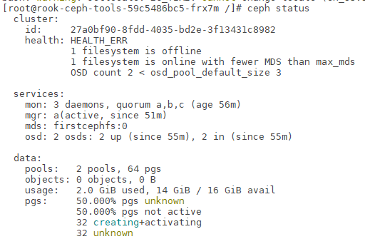
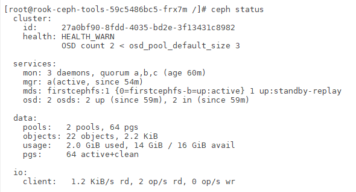

# Lab ROOK


## install Helm
```shell script
  k --namespace kube-system create sa tiller
  k create clusterrolebinding tiller --clusterrole cluster-admin --serviceaccount=kube-system:tiller
  wget https://get.helm.sh/helm-v3.2.0-linux-amd64.tar.gz
  tar -zxvf helm-v3.2.0-linux-amd64.tar.gz
  cd linux-amd64/
  sudo cp helm /usr/local/bin/helm
  cd
  helm help     # check
```
## Install rook operator
```shell script
  k create ns rook  # create a namespace 
  helm repo add rook-release https://charts.rook.io/release
  helm install rook --namespace rook-ceph rook-release/rook-ceph
  watch kubectl get pod -A -o wide
```
## Check the version of ceph
```k get pod -A -o wide ```

## install ceph cluster 
```shell script
  git clone https://github.com/rook/rook.git
  git checkout v1.3.2
  cd /home/ubuntu/rook/cluster/examples/kubernetes/ceph
  k create -f cluster.yaml
  watch kubectl get pod -A -o wide
  k create -f toolbox.yaml
  k -n rook-ceph exec -it $(kubectl -n rook-ceph get pod -l "app=rook-ceph-tools" \
 -o jsonpath='{.items[0].metadata.name}') bash
```



## Create a Ceph Shared Filesystem
```shell script
  k create -f test-filesystem.yaml
  k -n rook-ceph exec -it $(kubectl -n rook-ceph get pod -l "app=rook-ceph-tools" \
   -o jsonpath='{.items[0].metadata.name}') bash
 or 
 kubectl exec -it rook-ceph-tools-86d9c9d647-jzrl2 sh -n rook-ceph
 sh-4.2# ceph -s
 ceph osd status
 ceph osd pool stats
```


## Create Deployment using Ceph Filesystem
```shell script
  k create namespace read-write-many-tutorial
```

`


```