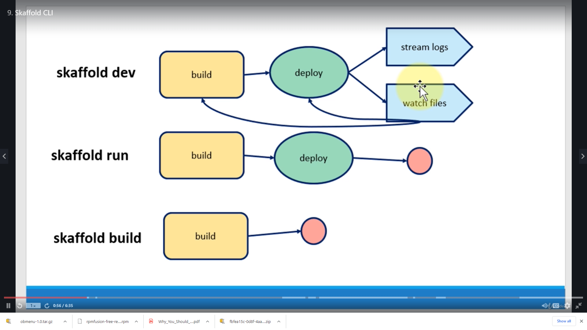

# Lab-skaffold
## install
```shell
sudo apt -y install jq
curl -Lo skaffold https://storage.googleapis.com/skaffold/releases/latest/skaffold-linux-amd64
chmod +x skaffold
sudo mv skaffold /usr/local/bin
skaffold version
```

## Examples
```shell
git clone https://github.com/crunchy-devops/skaffold.git
cd skaffold/examples
cd getting-started
# change the image name in the file skaffold.yaml and k8s-pod.yaml
docker login   # login to dockerhub
skaffold dev
# open another ssh session 
# change main.go as 
fmt.Println("Hello world! update")
# Check
```
Basic commands     


# multiple projects
go to ~/skaffold/examples/microservices   
check directories  
```mv skaffold.yaml skaffold.yaml.old```
Hit ```skaffold init```
Check  ```skaffold init --analyze | jq```