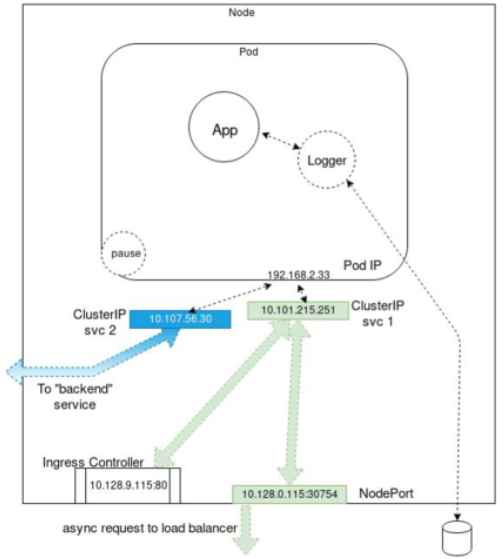

# Todo-flask-mysql-monolith
## On Docker
### Docker-compose version 
We are going to setup a python virtualenv

### On ubuntu
#### Packages, virtualenv, activate  
```code
sudo apt-get -y install python3
sudo apt-get -y install python3-pip
sudo apt-get -y install python3-venv
python3 -m venv venv
source venv/bin/activate
```
#### docker-compose set up
```code 
pip3 install wheel
pip3 install docker-compose
```
#### On Centos
```code 
sudo yum install python3
sudo yum install python3-pip
python3 -m venv venv
source venv/bin/activate
pip3 install upgrate pip
pip3 install wheel # some permission packages
pip3 install docker-compose # install docker-compose

```
#### Execute
In the directory todo-flask-mysql, hit   
```docker-compose up ```  # in foreground
or  
```docker-compose up -d``` # in background

Bring up your favorite browser   
``` http://localhost:5000/```
and check

## On Kubernetes
### Transfer the image to dockerhub 
```shell
docker build -t todo-monolith .
docker login 
docker image tag todo-monolith systemdevformations/todo-monolith:v1
docker push systemdevformations/todo-monolith:v1
```

### Install the pod and use pod Ip address
```shell
k create -f todo-monolith.yaml
# check the connectivity using POD Ip which is a private IP address 
k get pod -o wide 
# get the IP address and the node number
# ssh to node and type 
curl <IP>:5000
or  on the master type
k port-forward monolith-5ff76479d4-8t6j4 5000 
in an other shell in the master 
curl localhost:5000

```


### Set up a deployment and use Cluster IP address
```shell
# on the master type
k delete -f todo-monolith.yaml # delete the previous pod
k create -f deploy-todo-monolith.yaml 
k create -f service-monolith.yaml
k get pod -o wide 
# you get the clusterIP address and a port 
# ssh to node and type 
curl <IP>:5000